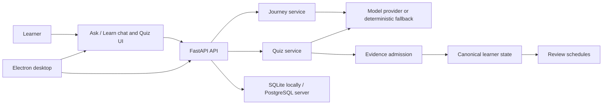

# Forma Main Doc

## Purpose

This is the running reference for what Forma is, how its harness currently operates, what is implemented, and which skills are planned. It is intentionally explicit about the difference between working functionality, prototype UI, and product direction.

## What Forma is

Forma is a local-first AI learning environment. It is intended to help learners understand, practice, retain, and connect concepts over time. Its core distinction is durable learner evidence: a completed chat response or a well-written note does not automatically count as mastery.

The current product runs as a React/Vinext user interface, FastAPI learning service, SQLite local store, and Electron desktop shell. PostgreSQL support exists for server deployment, but the desktop app uses local SQLite.

## Current harness flow

1. The learner starts an Ask/Learn session or requests a quiz.
2. The UI calls local FastAPI endpoints and tracks durable background jobs rather than relying on a page staying open.
3. The Journey service prepares a lesson route; the Quiz service prepares, presents, hints, grades, pauses, resumes, retries, and challenges assessments.
4. A provider boundary uses configured OpenRouter/OpenAI credentials when available, with deterministic fallback behavior for local testing.
5. Quiz results can propose evidence. `LearnerStateService` is the only writer of canonical concept state and admits evidence transactionally.
6. Accepted evidence can create or complete review schedules.
7. Electron runs the web app and API sidecar locally with loopback protection, local data paths, provider-key storage, recovery, and optional review notifications.

## Implemented capabilities

| Area | Present now | Important boundary |
| --- | --- | --- |
| Ask / Learn | Shared chat interface, Ask/Learn mode, teaching gears, lesson journey jobs, passage explanation actions. | Source verification and fully material-grounded teaching remain incomplete. |
| Quiz | Quiz creation, question preparation, answer submission, hints, pause/resume/retry, feedback, results, and item/attempt challenges. | Quality is an early pipeline, not yet a calibrated assessment system. |
| Assessment generation | Candidate generation, checking/evaluation paths, typed quiz/attempt/presentation records. | No claim that questions are expert validated or psychometrically calibrated. |
| Learner state | Evidence admission, canonical concept state, misconceptions, review schedules, audit events, optimistic revisions. | Current reducer and intervals are transparent heuristics, not knowledge tracing. |
| Materials | Local material upload/text ingestion, versions, blocks, source spans, session material selection, context manifests. | Hosted ownership and full retrieval/reranking are not ready. |
| Notes | Existing learner-scoped anchored note CRUD with revisions through state routes. | Obsidian-style Markdown vault, workspace tabs, backlinks, and `@note` context are planned. |
| Privacy | Local export/delete learner data and imported materials. | Hosted privacy/auth controls remain future work. |
| Desktop | Electron shell, bundled API/web assets, local app-data directories, encrypted provider keys, first-run settings, loopback token, sidecar restart, optional review notifications. | Current installers are unsigned; auto-update is not enabled. |
| Release automation | GitHub Actions packaging, beta signing/notarization gates, checksums, release runbook. | Signing secrets, interactive uninstall test, macOS validation, and an actual beta tag/release are still external work. |

## Skills currently in place

The code does not yet expose a user-installable skill marketplace. “Skill” currently means a bounded internal capability with its own input/output behavior.

| Internal capability | Current implementation | User-facing path |
| --- | --- | --- |
| Topic/graph generation | Graph generator and graph job flow. | Start or scope a learning topic. |
| Teaching journey preparation | `JourneyService` prepares and commits guided lesson routes. | Learn mode. |
| Passage explanation | Lesson explanation endpoint asks a configured provider to explain selected lesson text by mode. | Select text and choose explanation action. |
| Quiz creation | `QuizService.create` creates a durable quiz record. | Quiz workspace. |
| Question generation/preparation | Assessment generation plus `QuizService.prepare`. | Next quiz question. |
| Hint generation | Quiz hint operation. | Hint action on a presentation. |
| Answer evaluation | Assessment evaluation plus `QuizService.grade`. | Submit quiz answer. |
| Evidence admission | `LearnerStateService.admit_evidence`. | Behind assessment completion; not a direct UI skill. |
| Review scheduling | Learner state reducer creates/completes schedules. | Review queue and desktop reminder infrastructure. |
| Material ingestion/context | `MaterialService` and material routes. | Upload/select materials and material-answer flow. |
| Branch and anchored-note persistence | `LearnerStateService` branch/note operations. | Existing exploration/note APIs. |
| Local data control | Privacy export/delete routes. | Your workspace settings. |

## Planned skills

| Planned skill | What it does | Product surface | Dependency |
| --- | --- | --- | --- |
| `recommend_next_action` | Ranks Learn, Ask, Quiz, and Review next moves. | Action cards below chat and Progress. | Canonical state, graph, review queue. |
| `diagnose_gap` | Finds the smallest uncertainty or prerequisite gap worth checking. | Learn planner. | Evidence and concept graph. |
| `explain_concept` | Produces a constrained concept explanation. | Learn chat. | Source/context policy. |
| `ask_socratic_question` | Elicits reasoning before revealing an answer. | Learn chat. | Journey checkpoint and learner context. |
| `generate_counterexample` | Creates a contrast case that exposes a misconception. | Learn/repair card. | Concept/rubric support. |
| `create_note_draft` | Produces an editable note from a lesson, selection, or feedback. | Chat to Notes workspace. | Markdown note model. |
| `mention_note_context` | Resolves selected `@note` content into an explicit context manifest. | Ask/Learn composer. | Notes index and permissions. |
| `repair_misconception` | Chooses explanation, example, or discriminating check after an error. | Quiz feedback / Learn. | Evaluated attempt and state. |
| `author_assessment` | Authors an item blueprint under concept/source constraints. | Quiz preparation. | Question quality pipeline. |
| `check_assessment` | Independently checks item validity and leakage. | Internal quality gate. | Separate model/provider or deterministic checks. |
| `grade_reasoning` | Grades a response against a typed rubric with uncertainty handling. | Quiz feedback. | Evaluation policy. |
| `schedule_review` | Creates a justified retrieval activity and timing. | Review tab. | Evidence policy. |
| `summarize_learning_state` | Explains learner evidence and recommended next work. | Progress/Concept detail. | Canonical state projection. |

## Non-negotiable architecture rules

1. `LearnerStateService` remains the sole writer of canonical learner concept state.
2. Notes, chat completions, clicks, and raw answers are not mastery evidence by themselves.
3. Every skill receives explicit, minimum necessary context and returns typed output.
4. Learn and Quiz share learner state, concepts, materials, evidence, and review schedules; they do not create parallel memory stores.
5. Local learner data stays user-controlled. Provider keys remain in OS-backed secure storage.
6. A hosted edition requires real authentication and ownership enforcement; development headers are not production authentication.
7. Model output must disclose source support/limitations rather than inventing verification.

## Near-term build sequence

1. Fix and validate the packaged desktop UI and development workflow.
2. Build the right workspace panel, local Markdown notes, and `@note` context.
3. Add visible next-action recommendation cards after Learn and Quiz events.
4. Build explainable concept-state and Review tabs.
5. Strengthen author/check/evaluate assessment quality gates.
6. Add material-grounded lesson and quiz context with source receipts.
7. Add evaluation fixtures before making adaptation or retention claims.

## Reference documents

- [Features to Work On](Features_to_Work_On.md)
- [Note Taking Feature Plan](Note_Taking_Feature_Plan.md)
- [Learn and Quiz Product Technical Blueprint](Learn_and_Quiz_Product_Technical_Blueprint.md)
- [Desktop Application and GitHub Release Plan](Desktop_Application_and_GitHub_Release_Plan.md)
- [Persistent Learner State Contract](../backend/STATE_CONTRACT.md)
