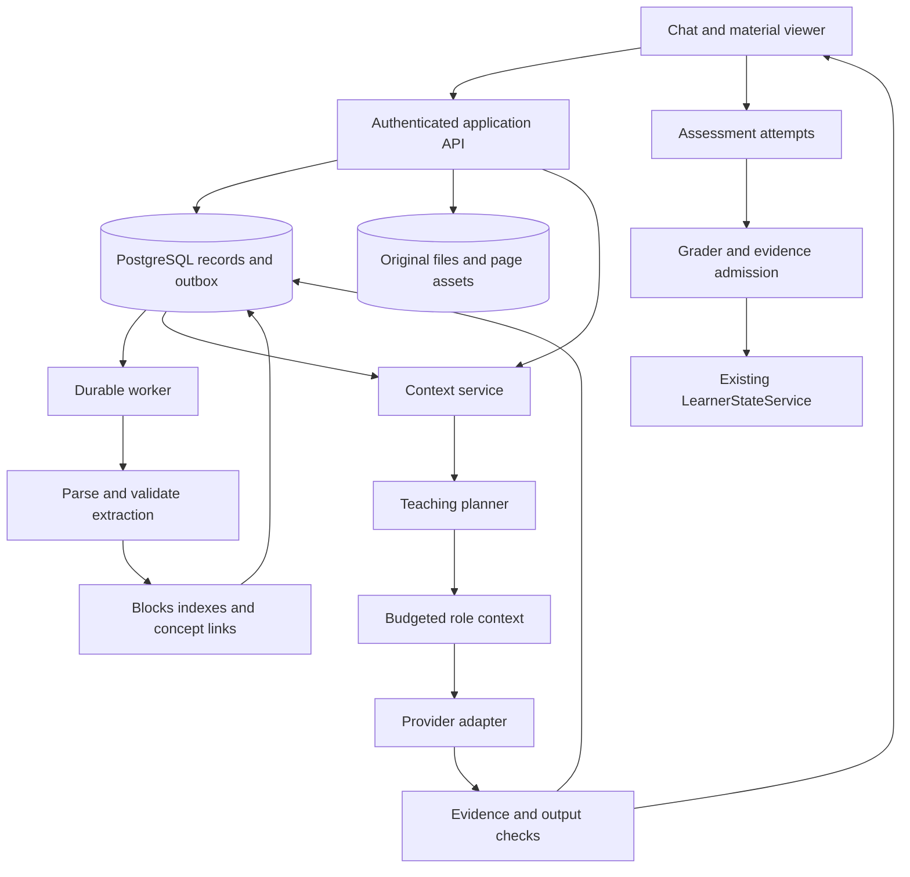

# Materials Context and Practice Implementation Specification

Version 1.0 | 13 September 2026 | AI Tutor Harness

Project root: `C:\Projects\AI Tutor harness`

## 1 Purpose and execution boundary

Build a material-aware tutoring system that can ingest textbooks, lecture notes, pasted text, and sample papers; preserve their structure and provenance; retrieve the right evidence for each teaching action; maintain continuity across lessons and branches; and generate validated practice from reusable question blueprints.

This document is the implementation handoff for that extension. It covers product behavior, architecture, storage, context assembly, compaction, assessment generation, interfaces, migration, tests, and release gates. The current request authorizes preparing this specification. A subsequent instruction to an implementation agent should identify the work packages to execute. This document does not itself authorize publishing, purchasing services, or changing external accounts.

The recommendations below are proposed implementation decisions unless explicitly identified as existing behavior or a documented external harness mechanism. Numerical budgets are initial configurable defaults, not measured learning outcomes or vendor limits.

Earlier phase-one documents deferred uploads and full practice workflows. This specification explicitly designs those extensions without redefining all of phase one or replacing its arbitrary-topic learning capability. Materials enhance an existing topic or session; a learner must still be able to learn without uploading a file. A full course-management product, institutional exam delivery, and shared classroom administration are not prerequisites for this work.

### How the implementation agent should use this document

1. Read the repository guidance and current code before editing; this snapshot can become stale.
2. Preserve the existing learner-state authority, graph contracts, teaching controls, and working interfaces.
3. Execute work packages in dependency order from Section 23. Complete a vertical slice before expanding formats or model orchestration.
4. Use the deterministic adapters and authored fixtures to verify behavior without requiring paid model calls.
5. Keep all project files under the project root. Do not overwrite unrelated changes or assume existing uncommitted work belongs to this task.
6. Report implemented behavior separately from scaffolding and unvalidated model behavior. Do not label material-supported output as independently correct merely because citations exist.

## 2 Product outcomes

The learner should be able to attach a textbook in chat, begin discussing an available chapter while processing continues, select an equation or passage for explanation, follow exact citations back to the original page, and receive teaching adapted to their demonstrated prerequisites.

The learner should also be able to upload a sample paper and request more questions with its structure, topic coverage, reasoning demands, and marking pattern. The application should remember the paper and its reusable blueprint after the conversation is compacted or closed. Generated practice, solutions, and later attempts must be durable records rather than ephemeral chat text.

The product should reduce repeated context-setting: the learner should not need to reupload the same book, restate which chapter they are studying, repeat their teaching preferences, or remind the tutor where a branch began.

### Primary journeys

| Journey | Expected result | Persistent output |
|---|---|---|
| Upload a textbook | Readable material, navigable sections, processing coverage | Material version, blocks, indexes |
| Explain a selected passage | Focused lesson using the surrounding evidence and learner state | Lesson, branch anchor, context manifest |
| Teach a concept from materials | Minimal prerequisite repair, cited teaching, return to target | Plan, lesson, continuation position |
| Compare lecture notes and textbook | Explicit agreement, convention difference, or unresolved conflict | Evidence links and conflict records |
| Generate questions like a sample paper | A saved set matching a confirmed blueprint within stated limits | Blueprint revision, item family, item versions, set |
| Solve a generated question | Correct feedback and assistance-aware evidence | Attempt, grading record, evidence proposal |
| Resume next week or switch model | Same task position and accessible materials | Canonical state plus portable checkpoint |

### Non-negotiable invariants

- Uploading, reading, saving a note, generating a lesson, or generating a question does not establish mastery.
- `LearnerStateService` remains the sole writer of canonical learner concept state.
- Original material, generated interpretation, personal notes, and learner evidence remain distinguishable.
- The archive is larger than active context. Retrieval indexes and summaries are rebuildable projections, not primary truth.
- Every source-backed claim points to an authorized, versioned source span that can be reopened.
- Private rubrics and answer keys are excluded from learner-facing responses and assessment-mode tutor context until the release policy allows them.
- Conversation compaction cannot change goals, preferences, permissions, accepted evidence, pending questions, or return positions.
- A document cannot introduce system instructions, tools, privileges, or learner-state writes.
- Read access is checked before retrieval, before provider dispatch, and before delivering results if access changed during the run.

## 3 Repository baseline and integration findings

This section reflects read-only inspection on 13 September 2026, not a test certification. The working tree already contains uncommitted backend/provider and frontend changes; preserve and extend them. Documentation is partly behind the code.

| Existing area | Observed implementation | Required extension |
|---|---|---|
| `backend/app/main.py` | FastAPI sessions, actions, plans, lessons, explanation route | Add material attachment references; dispatch durable long work; unify explanation context |
| `backend/app/learning_policy.py` | Typed context assembly, prerequisite traversal, teaching profile | Read canonical evidence; add evidence-aware planning input |
| `backend/app/policy_models.py` | `ActionContext`, `TeachingPlan`, policy validation | Add versioned context packet/manifest references without conflating policy and source verification |
| `backend/app/model_provider.py` | Server-side OpenRouter adapter and OpenAI route; structured lesson blocks | Accept actual assembled context, evidence, tool results, and provider capabilities |
| `backend/app/learning_kernel.py` | Renders plan through deterministic or model provider | Preserve block-level provenance and verified/qualified outcomes |
| `backend/app/state_service.py` | Canonical evidence admission, learner state, branches, notes | Reuse authority; extend anchors and evidence provenance for materials and practice |
| `backend/app/storage.py`, `database.py` | SQLAlchemy-backed persistence with PostgreSQL and local SQLite support | Add relational tables and migrations; keep ownership explicit |
| `backend/migrations/versions` | Migrations through `0004_teaching_policy.py` at inspection | Choose the next free revision when implementing; never overwrite another migration |
| `web/lib/api.ts` | Typed API client and camelCase contracts | Material, context-status, practice, citation, and job contracts |
| `web/components/learn-chat.tsx`, `learning-workspace.tsx` | Current learning UI and chat work | Attachments, material shelf, citation viewer, practice actions; preserve current layout |

### Concrete issues the new design must resolve

1. The inspected model provider accepts `ActionContext` but currently discards it with `del context`. Its prompt cannot use the structured learner data or future retrieved evidence. Replace this boundary deliberately rather than adding retrieval that never reaches the model.
2. The inspected action path loads `LearnerGraphRepository` and passes the visual projection into `_evidence_projection`. The persistent state contract says canonical learner state must drive decisions. Introduce a read adapter from `LearnerStateService` for relevant concepts, and keep the graph projection for UI use. Test a stale projection against canonical evidence.
3. Existing policy validation explicitly does not establish source-backed correctness. Preserve that distinction and introduce separate evidence verification records; do not flip its booleans simply because a source ID exists.
4. Existing generated blocks can inherit concept source IDs. A concept-level source list is not proof that a particular generated sentence is supported. Validate each claim against the spans actually provided to generation.
5. The current explanation path supplies selected text and lesson context directly. Route it through the same context service as the main lesson, with a stable anchor and authorized sources.
6. Long model work currently occurs within action handling. Move expensive ingestion and generation into persistent jobs while retaining API compatibility and replayable events.
7. The current provider response parsing can inspect reasoning-related fields. In the new adapter, accept only designated final-output fields for lesson content; reasoning, refusal, and incomplete output are separate outcomes, never fallback teaching text.
8. Development learner headers and request-supplied learner IDs are not production authentication. They may remain only in local mode. Hosted material access must derive identity from a trusted authenticated principal.

No existing code is changed by this specification. These findings establish implementation seams and regression cases.

## 4 What to borrow from other harnesses

The following observations come from public documentation retrieved on 13 September 2026. They describe the cited surface/version, not every implementation detail of a vendor's products. The adaptation column is our own design proposal. We are borrowing patterns, not embedding or reverse-engineering the coding products.

| Source | Documented mechanism | Adaptation for this tutor |
|---|---|---|
| Codex instructions [R1] | Global/project `AGENTS.md` guidance is assembled into context | Small versioned teaching policies and course conventions loaded separately from conversation |
| Codex skills [R2] | Skill descriptions are initially visible; full instructions load when selected | Advertise available teaching procedures and material outlines, load detailed procedure/content on demand |
| Codex CLI [R3] | Saved sessions can be resumed | Persist transcripts, continuation positions, and active material versions |
| OpenAI API [R4] | Native compaction can return an opaque encrypted continuation item | Optional provider-specific conversation acceleration; retain our own portable structured checkpoint |
| Claude Code memory [R5] | Written instructions and auto memory are separate mechanisms | Explicit learner preferences separate from inferred, evidence-linked teaching tendencies |
| Claude Code context [R6] | Context includes instructions, read content, and tool output; compaction and isolated subagent contexts reduce pressure | Keep recent tutoring dialogue local, delegate bounded extraction/checking, and preserve canonical learning state externally |
| Claude Code sessions [R7] | Transcripts persist independently of active context | Store append-only conversation events with permissioned retrieval |
| OpenCode rules [R8] | `AGENTS.md` provides persistent project guidance | Maintain auditable policy versions rather than relying on old chat instructions |
| OpenCode V2 compaction [R9] | Checkpoints replace older active context while older messages remain stored; recent context can be retained | Atomic checkpoint plus recent tail; no transcript deletion merely to reduce model input |
| OpenCode V2 instructions [R10] | Instruction state is tracked separately from conversational checkpoints | Version teaching policy and rehydrate it independently of summary text |
| OpenCode V2 agents [R11] | Agent configuration defines role and capabilities | Explicit planner/tutor/verifier capabilities; no unrestricted shared memory |
| OpenCode V2 attachments [R12] | Attachment acceptance and model-visible formats are distinct | Separate uploaded, extracted, indexed, and usable states; never claim unread content was read |
| Provider prompt caching [R13, R14] | Repeated prompt computation can be reused | Stable policy prefixes where supported; caching is an optimization, not permanent memory |

OpenCode V2 references must remain labeled V2; do not apply its checkpoint settings or API shapes to V1. No OpenCode file layout or internal session schema is a dependency of this project.

### Patterns to adapt carefully

Coding agents can reopen files when a summary omits a detail. Our tutor must similarly reopen source spans, but it must also preserve a pending assessment, assistance history, and unresolved misconception exactly. Those are structured records, not prose summary guesses.

Automatic memory can suggest that examples are helpful, but it cannot certify that a learner understands a concept. Independent agent agreement is not a correctness test. Skills should govern a teaching procedure, while uploaded books remain untrusted evidence. Model-specific compacted state should never be the only surviving record of a learning session.

## 5 Architecture and technology decisions

Extend the existing Python FastAPI modular backend and React/TypeScript client. Do not introduce another backend framework or move the learner state to a second database. Keep model selection behind provider adapters already present in the repository.



### Initial deployment choices

- PostgreSQL is the canonical production database. Use its full-text search and pgvector for the first search implementation, subject to extension availability. pgvector supports storing and searching vectors with relational data [R15].
- Keep SQLite for deterministic local/unit tests. Implement a small exact-search adapter for fixtures; do not imply it validates PostgreSQL ranking or locking. Run separate PostgreSQL integration tests.
- Add an `ObjectStore` interface with a local adapter under `backend/data/materials/` for development and an S3-compatible private store adapter for deployment. Store object keys, never user-supplied filesystem paths.
- Use a database-backed jobs table and separate Python worker initially. Workers claim jobs with leases and PostgreSQL row locking; retries and outbox delivery are durable. A managed queue can replace dispatch later without changing job semantics.
- Use Docling as a candidate parser adapter for PDFs and supported document formats. Its structured document representation is relevant to layout, tables, reading order, and source locations [R16]. Evaluate it against fixtures before declaring a format supported.
- Keep provider-specific token counting, media handling, response parsing, and native compaction in adapters. No new LLM training is required.
- Do not choose a hosting provider, purchase a service, or replace the current frontend runtime as part of this specification.

## 6 Memory model and ownership

### Storage versus active context

| Memory class | Owner and representation | Persistence | Inclusion in model requests |
|---|---|---|---|
| Original materials | Material service, immutable object versions | Until deletion/retention policy | Selected pages or image regions only |
| Extracted evidence | Material blocks and source spans | Versioned, rebuildable from originals | Actual relevant text, tables, equations |
| Retrieval indexes | Search service, vectors and lexical indexes | Derived, versioned | Search results; vectors themselves are not evidence |
| Curriculum | Existing graphs plus material-concept links | Canonical graph versions | Target and bounded relevant neighbors |
| Learner knowledge | Existing state service and accepted evidence | Canonical, versioned | Relevant concept states and evidence summaries |
| Teaching preferences | Explicit settings and inferred suggestions | Versioned, editable | Applicable resolved preferences |
| Session and branches | Session service, transcript events, anchors | Durable | Current state, checkpoint, recent tail |
| Exam patterns | Paper profiles and blueprint revisions | Durable reusable records | Selected blueprint and representative examples |
| Questions and solutions | Assessment service, separate visibility classes | Immutable item versions | Role- and mode-dependent |
| Context packet | Context service, manifest plus referenced content | Run-scoped audit retention | Exact rendered input for one model step |
| Native provider checkpoint | Provider continuation store | Provider-specific and revocable | Only for compatible continuation routes |

A user's library attachment persists across sessions until detached or deleted. Default attachment scope is the current session, with explicit promotion to a topic/library collection. Do not silently make every private upload available to every future conversation. Within a session, attachments remain available through compacted context via IDs and retrieval tools.

### Canonical and derived separation

Canonical data includes original versions, explicit preferences, committed session positions, item definitions, attempts, and admitted learner evidence. Derived data includes summaries, inferred topic tags, embeddings, retrieved snippets, and display projections. Each derived record stores its source version and pipeline version. A stale derived record must be rebuilt or excluded; it must not silently override newer canonical state.

### Authority hierarchy

Application policy and authorized operation boundaries govern execution. The user's current request governs the learning task within those boundaries. Explicit learner settings govern presentation unless the current request overrides them. Course documents supply evidence and conventions, not application instructions. Personal notes and inferred preferences are contextual signals. Quoted text never gains higher authority by being repeated in a checkpoint.

## 7 Upload and ingestion lifecycle

### Supported scope and initial limits

First slice: text-based PDF plus UTF-8 TXT/Markdown and pasted text. Second slice: scanned PDF, PNG/JPEG page images, and DOCX. Later: slides, spreadsheets, audio/video and URL imports. The UI must reject unsupported formats honestly rather than storing an attachment that the tutor cannot inspect.

Proposed local pilot limits: 50 MiB per file, 1,000 pages per PDF, 10 attachments per submission, and 100,000 characters per pasted material. Apply these server-side and make them configurable. Larger material may be accepted later through separate quotas and background processing. Extractors also need CPU, memory, runtime, decompression, and page-image limits; file-size checks alone are insufficient.

### Upload transaction

1. Authenticate the owner, validate declared type/size, and create `material` plus pending `material_version` records.
2. Issue a short-lived upload URL or use the local upload endpoint. Store into a private staging key.
3. On completion, verify size, hash, detected media type, ownership, and parseability. Never trust extension or client hash alone.
4. Commit the object reference and enqueue ingestion through the transactional outbox. Use a unique job key based on owner, material version, parser configuration, and stage.
5. Return version ID and job ID. Display processing state without blocking the main chat.

Deduplicate identical content within the same owner's authorized scope. Do not expose cross-user hash matches. A renamed duplicate can reuse extraction internally while retaining its own attachment metadata. A changed file is a new immutable version.

### Processing stages

`uploaded -> validating -> extracting -> indexing -> mapping -> ready`

Also support `partially_ready`, `needs_attention`, `failed`, `cancelled`, and `deleting`. Track per-stage and per-page readiness; overall progress is not an assertion that every page is readable. `partially_ready` permits retrieval only from completed, published blocks.

A worker checkpoint records page ranges, artifacts, attempts, and errors. Restarting reuses committed successful stages. Publish each searchable section atomically with its blocks and index generation. Duplicate worker completion must not duplicate concepts or source records. Enforce unique stage keys and lease ownership during commit.

### Extraction outputs

Preserve chapters, section hierarchy, reading order, paragraphs, equations, variable definitions, tables, captions, images, worked examples, question numbers, subparts, marks, instructions, and answer regions. Each block references exact page and bounding region where available. Store normalized text alongside original extracted text; do not overwrite the original with model paraphrases.

Flag uncertain OCR symbols, missing table structure, unresolved question continuations, and unreadable diagrams. A fallback vision pass may inspect the original crop. Unresolved critical content is excluded from verified teaching or question generation. Password-protected or corrupt files produce a recoverable error with no fabricated content.

## 8 Document blocks and searchable units

Use three levels: document outline, semantic blocks, and retrieval chunks. The chunk is an indexing unit; the block/span is the citation unit. Do not use a chunk's generated summary as if it were a quotation from the book.

```json
{
  "id": "block_182",
  "materialVersionId": "matver_finance_1",
  "extractionVersion": "extract-v1",
  "sectionId": "section_discount_rates",
  "sectionPath": ["Valuation", "Discount rates", "WACC"],
  "pageIndex": 141,
  "printedPageLabel": "128",
  "kind": "equation",
  "text": "Example extracted equation text",
  "bbox": {"x0": 0.1, "y0": 0.3, "x1": 0.9, "y1": 0.4},
  "coordinateSystem": "normalized_top_left",
  "relatedBlockIds": ["block_variable_definitions"],
  "extractionStatus": "needs_review"
}
```

Page indexes are zero-based physical file pages. Printed labels can be Roman numerals or absent. Bounding boxes must reference page rotation and coordinate convention in the page record. Frontend selection offsets use UTF-16 code units; the server explicitly converts them to stored Unicode code-point offsets and validates the selected text hash. Do not assume JavaScript and Python string offsets coincide.

### Chunking defaults

Start around 400-800 tokens per chunk, with a hard split around 1,200 where appropriate. These are tuning defaults, not requirements to split a formula or question. Keep definitions with their equation and a question's stem with its necessary data. Large examples become linked parts with a parent section reference. Use explicit neighboring block links instead of extensive overlapping copies.

Attach a short context label such as chapter, objective, and subject to the search representation. Store generated contextual descriptions separately from source text. This follows the motivation of contextual retrieval without claiming that its published results transfer to our corpus [R17].

Embedding records include model ID, dimension, input hash, normalization version, and index version. Re-embedding with another model creates a new compatible index; never mix dimensions or embedding spaces silently.

## 9 Concept linking and teaching units

Map extracted evidence to existing graph concepts using labels, aliases, surrounding context, and objective compatibility. A candidate new concept or prerequisite is a proposal with source references and a review state. A chapter order is not proof of a hard prerequisite. Publishing material links must not automatically change a live session's pinned graph revision.

A teaching unit stores objective, concept links, supporting spans, prerequisites, assumptions, representations, candidate examples, and assessment references. Keep extracted content and generated additions labeled. Enrich units on demand for the selected chapter or concept rather than pre-generating every possible lesson at upload time.

Support multiple sources for one concept. Record whether a relationship is supporting, contrasting, an example, a convention, or a contradiction. The syllabus defines course coverage; lecture slides can define notation; neither makes an incorrect factual statement automatically authoritative.

A source conflict creates a reviewable record with both spans and the affected concepts. Until resolved, the tutor presents a qualified explanation and identifies the difference. It must not average two incompatible equations or silently substitute one book's assumptions for another's.

## 10 Context service and role contracts

### Service boundaries

`ContextService` assembles context, `RetrievalService` obtains evidence, `TeachingPlanner` chooses the pedagogical action, `ContextRenderer` converts a packet to provider inputs, and `ContextManifestStore` records what was used. They can be modules in the same process. Each provider call receives a distinct manifest, including tool rounds and verification calls.

`ActionContext` remains the typed teaching-policy input. Introduce `ModelContextPacket` for actual text/media and a `ContextManifest` for audit. Do not put a full textbook into `ActionContext` or return private rendered prompts from an ordinary run-status endpoint.

### Context assembly sequence

1. Resolve trusted identity, session ownership, selected material versions, lesson/branch anchor, mode, and requested action.
2. Pin a graph revision, canonical learner-state version, session revision, preference version, source-policy version, and permission epoch for this model step.
3. Read only the relevant canonical concept states. Load the exact current question and assistance history if in practice.
4. Load a valid checkpoint and uncompacted recent tail without overlap. Fetch referenced older messages only if the current request needs them.
5. Resolve target concepts and prerequisites. Retrieve task evidence; validate source availability and assessment visibility.
6. Build or refine the existing teaching plan using the available evidence and learner gaps. One additional retrieval pass may fill a plan-required gap.
7. Select authorized tool descriptors for the role. Reserve input/output/media budgets and construct the packet.
8. Persist a manifest before dispatch, recording selected and excluded records and reasons.
9. Generate or request bounded tool reads. Each tool result is scoped, size-limited, and traced; rebuild the next step using the same rules.
10. Validate final structured output and claims. Commit content only if still authorized and applicable; update session position using optimistic concurrency.

### Packet example

```json
{
  "schemaVersion": "1",
  "runId": "run_42",
  "step": 1,
  "role": "tutor",
  "mode": "learn",
  "instructionVersion": "tutor-policy-v1",
  "sessionSnapshot": {
    "sessionId": "session_42",
    "revision": 7,
    "goal": "Understand DCF valuation",
    "currentConceptId": "wacc",
    "branchId": "branch_7"
  },
  "learnerSnapshot": {
    "stateVersion": 12,
    "concepts": [
      {"conceptId": "capital_structure", "status": "demonstrated", "evidenceIds": ["ev_8"]},
      {"conceptId": "market_value", "status": "unassessed", "evidenceIds": []}
    ]
  },
  "teachingPlanId": "plan_42",
  "checkpointId": "checkpoint_4",
  "recentMessageIds": ["msg_31", "msg_32"],
  "evidence": [{"spanId": "span_17", "text": "Actual authorized source text is inserted here."}],
  "tools": ["search_materials", "get_source_blocks"],
  "excludedClasses": ["private_solution", "assessment_key"],
  "manifestId": "ctx_42_1"
}
```

The packet stores IDs for traceability, but the renderer must resolve actual recent messages, checkpoint content, plan instructions, and evidence text before dispatch. Never send bare IDs and expect the model to know their contents. Media is attached through the provider adapter only when needed and supported.

### Role-specific access

| Role | Required input | Excluded by default | Output |
|---|---|---|---|
| Planner | Goal, canonical state, graph neighborhood, source coverage | Private answer keys, entire transcript | Typed plan and evidence needs |
| Tutor in Learn | Plan, evidence, active dialogue, applicable preferences | Unrelated private history | Lesson blocks, claims, evidence references |
| Tutor in Practice | Current item, allowed hints, assistance state | Private solution and unreleased answer | Question/hint or feedback allowed by mode |
| Paper analyzer | Complete paper structure, question regions, mark scheme if authorized | Learner history | Paper profile and candidate blueprint |
| Question generator | Blueprint, concept evidence, allowed exemplars | Unrelated learner records | Candidate items and private solution candidates |
| Verifier/solver | Item or claims, source evidence, suitable tools | Unneeded conversation history | Check results and limitations |
| Grader | Exact item version, attempt, private rubric, assistance | Unrelated notes and materials | Rubric outcome and evidence proposal |
| Compactor | Canonical continuation references plus bounded transcript segment | Private keys, unrestricted tools | Checkpoint proposal only |

## 11 Retrieval algorithm and context budgets

### Retrieval routes

Selected passage: exact anchor first, then adjacent definition/example blocks. Concept lesson: concept-source links plus lexical and semantic search. Follow-up: resolve pronouns using the parent lesson and recent dialogue before searching. Whole chapter/book question: use outline-guided coverage, not a top-five-passage answer presented as exhaustive. Sample-paper matching: read the paper profile and blueprint, not an arbitrary set of similar chunks.

### Proposed hybrid retrieval

1. Apply ownership, active-version, readiness, material-scope, and answer-visibility filters before exposing results. Hidden answer text must never enter reranker or summarizer input for assessment tutoring.
2. Retrieve up to 30 lexical and 30 vector candidates plus direct concept/anchor matches. Deduplicate on source span/version.
3. Fuse lexical/vector ranks using reciprocal rank fusion with configurable initial constant 60. Exact selected spans are mandatory evidence and are not lost through ranking.
4. Rerank a bounded candidate pool for the actual objective. If no reranker is configured, use an explicit deterministic fallback and record the method.
5. Expand selected chunks to essential definitions, assumptions, related figures, or full question groups. Reapply authorization and budgets after expansion.
6. Pack approximately 6-12 relevant evidence units, subject to token and coverage requirements. These counts are starting defaults, not proof of completeness.
7. If a required assumption, figure, or definition remains absent, request at most two additional retrieval rounds for a lesson. Stop with `insufficient_evidence` rather than guessing.

Document-wide tasks use a separate map/reduce-style job with an explicit coverage ledger. Summaries navigate to evidence; final claims are checked against original spans. Incomplete extraction must appear in the coverage result.

### Budget calculation

Calculate the usable input budget as the minimum of the application role budget, the provider input limit, and the context limit minus required output/reasoning reserve and a safety margin. Include system instructions, tool schemas, actual serialized history, tool results, and media costs. The adapter owns provider-specific counting; unknown counts require conservative estimates and overflow handling.

Proposed ordinary tutor input budget: 12,000 tokens, allocated initially as 1,000 instructions/tools, 1,500 plan/state, 2,000 selected passage plus recent dialogue, 6,000 evidence/examples, and 1,500 expansion allowance. These allocations are targets; mandatory material can consume more by reducing optional categories. A 2,500-token visible output allowance is an ordinary default, not a universal limit. Deep lessons should use coherent steps instead of unbounded output.

Never silently truncate the current user request, active item, selected equation, answer choices, critical assumptions, or tool call/result pairing. Drop redundant examples, unrelated history, and optional graph neighbors first. If required content cannot fit, split the task or use an eligible larger-context route within budget. Provider overflow gets one bounded reassembly attempt; repeated overflow fails clearly.

### Context quality checks

Before dispatch verify: current question included; selected anchor resolves; canonical state version present; necessary definitions present or marked missing; evidence authorized and non-stale; private keys absent; required source IDs backed by text/media; budget respected. Context sufficiency and factual correctness are separate checks.

## 12 Session continuation and compaction

Persist complete conversation events subject to retention policy. Maintain a compact active window consisting of stable policy, canonical state snapshot, completed checkpoint, recent dialogue, and current retrieved evidence. It is not necessary to make every turn stateless, but the backend must be able to reconstruct an equivalent portable request.

### Portable checkpoint schema

```json
{
  "schemaVersion": "1",
  "id": "checkpoint_4",
  "sessionId": "session_42",
  "branchId": "branch_7",
  "throughSequence": 30,
  "baseSessionRevision": 7,
  "goalRef": "session_42",
  "completedObjectives": [{"conceptId": "wacc", "activity": "explained", "messageIds": ["msg_22"]}],
  "openQuestions": [{"text": "Why market values?", "messageId": "msg_29"}],
  "explanationsTried": [{"representation": "company_example", "messageId": "msg_27"}],
  "returnPositionRef": "branch_7",
  "activeAttemptId": null,
  "materialVersionIds": ["matver_finance_1"],
  "evidenceRefs": ["span_17"],
  "status": "completed"
}
```

The example records exposure as explained, not mastered. Mastery is reloaded from canonical state after compaction. Explicit preferences, pending answer text, attempt state, source permissions, and branch positions are hydrated from their own records rather than trusted to a generated summary.

### Compaction algorithm

Trigger before estimated input exceeds 80 percent of the usable role budget, provided sufficient old history exists to summarize. Keep an initial target of 2,000 recent-dialogue tokens, with whole messages or complete tool exchanges. These are our defaults, not copied vendor settings.

At a safe step boundary, pin the transcript sequence and create a checkpoint proposal over older history. Validate schema, all references, preserved open questions, and no unauthorized state assertions. Commit it atomically with its covered sequence. New messages after that sequence remain in the tail. A failed checkpoint leaves the previous active window intact.

Do not compact unresolved tool calls without their corresponding results, or rewrite an active question into a paraphrase. A pending assessment remains pinned by immutable item and attempt IDs. Rehydrate important content directly from records after every checkpoint.

### Native compaction and model switching

Native provider compaction is optional and off by default in the first portable implementation. If enabled, store an envelope with provider, model, endpoint, protocol, policy version, source permissions epoch, and compatible continuation identifier. Treat opaque checkpoint content as sensitive because it may encode private material.

On incompatible route changes, revoked sources, deleted private content, or unsupported continuation, discard the active native checkpoint and rebuild from authorized canonical records, portable checkpoint, and retained transcript. Never send one provider's opaque checkpoint to another provider. Prompt caching likewise cannot restore missing canonical state or bypass access checks.

## 13 Branches notes and personalization

Reuse existing durable branch and note services. Extend anchors with material version, source span, page, and selected text hash through a versioned union. Preserve legacy concept/lesson anchors. An exact source selection opens a branch with its own transcript sequence and checkpoint, inherited material scope, and a saved parent position.

Branch creation receives only the parent excerpt, target objective, relevant learner state, and selected source references. It does not copy the entire parent transcript. Closing records a structured summary of what was explored and unresolved, but never merges arbitrary branch prose into mastery. Reopening restores branch history; returning restores the parent's exact anchor.

A note can cite material spans and generated lesson blocks. Store original user-authored content and immutable revisions using the existing note service; AI corrections are suggestions. Notes are not authoritative factual evidence unless independently checked. Material deletion can leave a tombstone citation in a retained user note, but must not leave retrievable copied source excerpts where deletion requires removal.

Explicit teaching preferences persist immediately with revision history. Inferred strategy preferences are suggestions with scope, confidence, evidence references, and decay; do not treat one Simpler click as a permanent ability judgment. Pilot adaptation should use transparent rules and learner overrides. Cross-subject preferences require evidence of applicability, not a global learning-style label.

## 14 Sample-paper analysis and blueprint storage

### What the request means

When the learner says "Create more questions like this paper," default to preserving topic mix, question format, approximate reasoning demand, marks, and solution-step structure while creating new situations and data. This is a generation target, not a claim of equivalent psychometric difficulty. Offer an editable preview of inferred constraints; ask only when an ambiguity changes the result materially.

Distinguish `paper_match` from `targeted_practice`. In paper-match mode, learner gaps may change feedback and suggested follow-up, but should not silently change the paper's difficulty or coverage. In targeted-practice mode, the user permits concept selection or scaffolding changes and the set is labeled accordingly.

### Full-paper extraction

1. Identify title, course, time limit, instructions, total marks, sections, choices, and question numbering.
2. Group each stem with its subparts, tables, diagrams, and continued pages. Separate question blocks from answers, marking schemes, and worked solutions.
3. Extract explicit marks and command verbs; infer concept links and reasoning steps with provenance and confidence.
4. Reconcile arithmetic: section totals, mandatory versus optional questions, and total achievable marks. A learner choosing three of five questions is not equivalent to answering all five.
5. Create a `paper_profile` and a draft `assessment_blueprint`. Uncertain extraction appears as an issue with a page reference.
6. Confirm or infer minimally specified options. If marks are unreadable or a diagram is essential but missing, block that part; do not fabricate a blueprint presented as faithful.

### Blueprint example

```json
{
  "id": "blueprint_7",
  "revision": 1,
  "ownerId": "learner_local",
  "sourceMaterialVersionIds": ["matver_sample_1"],
  "mode": "paper_match",
  "status": "validated",
  "title": "Probability short practice",
  "durationMinutes": null,
  "totalMarks": 20,
  "sections": [{"id": "section_a", "answerCount": 4, "availableCount": 4}],
  "slots": [
    {"id": "slot_1", "sectionId": "section_a", "conceptIds": ["conditional_probability"], "format": "short_answer", "marks": 5, "reasoningDemand": "two_step", "sourceQuestionIds": ["source_q1"]},
    {"id": "slot_2", "sectionId": "section_a", "conceptIds": ["independence"], "format": "explain", "marks": 5, "reasoningDemand": "justify", "sourceQuestionIds": ["source_q2"]},
    {"id": "slot_3", "sectionId": "section_a", "conceptIds": ["bayes_rule"], "format": "calculation", "marks": 5, "reasoningDemand": "two_step", "sourceQuestionIds": ["source_q3"]},
    {"id": "slot_4", "sectionId": "section_a", "conceptIds": ["expected_value"], "format": "calculation", "marks": 5, "reasoningDemand": "interpret", "sourceQuestionIds": ["source_q4"]}
  ],
  "constraints": {"preserveMarks": true, "newScenarios": true, "allowMissingSlots": false},
  "difficultyBasis": "inferred_from_structure_not_calibrated",
  "unresolvedIssues": []
}
```

This is an authored illustrative example, not analysis of an actual uploaded paper. Each inferred field in production needs provenance; explicit values link to source spans and inferred values link to the analysis run. Revisions are immutable. A practice set pins one revision even if the learner later edits the blueprint.

### Storage answer to the concrete user question

The uploaded paper lives in object storage. Its extracted questions and diagram references live in material records. Its analyzed structure lives in `paper_profiles` and `assessment_blueprints`. Reusable generation patterns live in `item_families`. Every generated question lives in `assessment_items` with an immutable version; private solutions and rubrics live in restricted `item_solutions`. The selected collection and order live in `practice_sets` and `practice_set_items`. A chat message contains links to these records, not their only copy.

## 15 Question generation validation and delivery

### Item families

An item family describes the concept, reasoning steps, permitted parameter domains, constraints, scenario variations, expected answer type, rubric structure, and optional solver template. It is reusable without storing the original paper as the entire model prompt. Preserve lineage to source question IDs and blueprint slots.

Changing numbers alone does not ensure a sound new question. Constraints must prevent impossible probabilities, singular systems, division by zero, inconsistent units, accidentally trivial solutions, or values beyond the intended scope. Parametric templates are preferred for domains where validity is executable. Generated code is not trusted solver code; only reviewed solver templates or isolated bounded execution are allowed.

### Generation pipeline

`requested -> blueprint_resolved -> planned -> generating -> validating -> assembled -> ready`

Terminal alternatives: `needs_input`, `partially_ready`, `failed`, `cancelled`. The requested set is durable before work begins. Each slot has its own candidate and validation states, so retrying one slot does not regenerate or reorder accepted items.

1. Pin blueprint revision, requested count/mode, source versions, graph version, novelty policy, and generation seed where applicable.
2. Allocate slots deterministically to match marks, formats, and coverage. If the user requests a shorter set, store the allocation rule and show the resulting blueprint adaptation.
3. Retrieve concept evidence and a bounded number of relevant exemplars, separated from their answer keys. The generator may receive authorized keys for pattern analysis; the learner-facing tutor does not.
4. Generate candidates with public stem/options/assets and private solution/rubric in separate typed fields and storage paths.
5. Validate solvability, answer correctness, scope, marks, assumptions, ambiguity, formatting, source consistency, and novelty.
6. For calculations, solve with a trusted deterministic/symbolic method when feasible. For open answers, validate against a grounded rubric and record reviewer uncertainty. Independent model review alone does not establish mathematical truth or calibrated difficulty.
7. Compare normalized text and semantic similarity against source questions, previous set items, and the learner's recently exposed item families. A near-duplicate triggers regeneration or explicit reuse labeling. Similarity is a screening signal, not proof of originality.
8. Allow at most two repair attempts per slot initially. Persist rejected candidates privately for debugging under retention limits; do not publish them as usable practice.
9. Commit the set atomically once all required slots pass. If only some pass, expose a clearly partial set only when requested or when the learner accepts the smaller count; do not label it complete.

### Public and private item records

Public fields: item ID/version, question text, visible data/assets, options, marks, response format, concept labels if the chosen mode permits them, and readiness status. Private fields: canonical answer, derivation, rubric, tolerance, solver artifacts, distractor rationales, source answer spans, and validation notes.

Never hide solutions with CSS while including them in the public JSON. Never place answer-bearing summaries into a general retrieval index. An uploaded paper containing answers requires classification of those regions before that source is used in exam-mode context. If separation is uncertain, exclude the affected region or disallow independent-assessment claims.

### Attempts and mastery

Persist item version, public presentation version, learner response, attempt timestamps, hints, retries, answer reveal events, and related-family exposure. Revealing an answer switches the attempt to assisted/exposed; later recall on the same or near-identical family is not independent transfer evidence.

Grade through a rubric or executable checker, store the result, then propose evidence through the existing admission boundary with stable deduplication ID. Rejected/invalid items cannot contribute accepted evidence. A corrected answer key supersedes the grading record and triggers evidence correction through the state service. It does not directly patch a mastery percentage.

## 16 Relational data model

Use existing learner/session/graph/branch/note/evidence tables where applicable. The names below are proposed new tables; reconcile against the latest migration head before creating them. All owner-bearing foreign references must be checked for owner compatibility; IDs alone are not access control.

| Table | Key fields and relationships |
|---|---|
| `materials` | id, owner_id, title, role, default_scope, latest_version_id, deletion_state |
| `material_versions` | id, material_id, version, object_key, sha256, media_type, byte_count, extraction/index versions, permission_epoch |
| `material_attachments` | id, material_version_id, session_id or topic_scope_id or library_id, owner_id, enabled, revision |
| `material_jobs` | id, owner_id, version_id, kind, stage, status, lease_owner/expires_at, attempt, dedupe_key, error |
| `material_pages` | version_id + page_index, printed_label, dimensions, rotation, image_key, readiness |
| `material_sections` | id, version_id, parent_id, title, order, page range |
| `material_blocks` | id, version_id, section_id, kind, original/normalized text, extraction_status, content_hash, order |
| `source_spans` | id, block_id, start/end code-point offsets, page_index, bbox, text_hash |
| `material_chunks` | id, version_id, section_id, block references, search text, context description, token estimate |
| `chunk_embeddings` | chunk_id + index_version, embedding model/dimension/vector, input_hash |
| `concept_material_links` | concept_id + graph_version + span_id, relation, review status, provenance |
| `teaching_units` | id, revision, objectives, concept links, source refs, generated/extracted component markers |
| `source_conflicts` | id, source spans, concepts, conflict type, resolution/version |
| `conversation_messages` | id, owner_id, session_id, branch_id, sequence, role, typed content, visibility, run_id |
| `context_checkpoints` | id, branch/session, through_sequence, schema/policy version, structured content, status |
| `provider_continuations` | id, compatible route signature, checkpoint reference, permission_epoch, encrypted object reference |
| `context_manifests` | id, run/step/role, snapshot versions, references, exclusions, estimated/actual usage, prompt hash |
| `teaching_preferences` | owner_id, scope, explicit settings, revision; inferred suggestions stored separately |
| `paper_profiles` | id, material_version_id, extracted question groups, instructions, totals, unresolved issues |
| `assessment_blueprints` | id, revision, owner_id, profile/source refs, slot definitions, constraints, validation status |
| `item_families` | id, revision, concept/blueprint links, parameter domains, solver reference, lineage |
| `assessment_items` | id, version, owner_id, family/slot refs, public fields, content hash, status |
| `item_solutions` | item/version, private answer/rubric, tolerances, solver/verification refs |
| `item_validations` | id, item/version, method/version, checks, outcome, limitations, artifacts |
| `practice_sets` | id, owner_id, blueprint revision, mode, requested/accepted counts, status, run_id |
| `practice_set_items` | set_id + position, item_id/version, slot_id |
| `assessment_attempts` | id, owner_id, item/version, set_id, response, assistance/exposure, grading status |
| `attempt_gradings` | id, attempt_id, rubric/evaluator version, result, evidence_id, supersedes_id |
| `content_dependencies` | parent_type/id/version, child_type/id/version, dependency purpose |

Use ordinary foreign keys for concrete material/assessment relationships. `content_dependencies` is an auxiliary invalidation graph, not a substitute for ownership checks or critical integrity constraints. JSON fields may hold versioned blueprints and structured content; retain relational columns for ownership, status, idempotency, and queryable identity.

Required indexes include owner plus session sequence; owner plus material; version plus page/order; full-text chunk search; vector index by embedding generation; graph/concept links; job claim status/lease; item-family exposure; and run/step manifests. Separate database roles or service access enforce private-solution access. A standard tutor database query must not select private solutions accidentally.

### Migration and local fallback

Add Alembic migrations, preserving existing data and camelCase API aliases. Existing rows receive safe defaults: no attached material, no checkpoint, no source-backed verification. Do not backfill invented citations. Legacy source references can be linked only when an exact provenance mapping exists.

Make pgvector installation an explicit deployment prerequisite with a clear readiness check; environments lacking it must either use a declared lexical-only mode or fail retrieval readiness. No silent semantic-search claims. Production migration runs should become controlled release work, particularly for backfills/index builds, rather than unbounded startup work.

## 17 API contracts and events

Extend existing `/v1/sessions/{sessionId}/actions`, run, lesson, and learner-state routes. Add routes below; all bodies are camelCase, errors typed, long work returns `202` with a durable job/run ID. No API accepts a direct mastery value from a client.

| Method and route | Behavior |
|---|---|
| `POST /v1/materials/uploads` | Validate upload request, create pending version, return upload target and ID |
| `POST /v1/materials/{materialId}/versions/{versionId}/complete` | Verify bytes, enqueue idempotent ingestion |
| `POST /v1/materials/text` | Create a versioned pasted-text material through the same indexing flow |
| `GET /v1/materials/{id}` | Metadata, versions, readiness, coverage, issues |
| `GET /v1/material-jobs/{id}` | Stage, completed ranges, failures, retry status |
| `POST /v1/material-jobs/{id}/retry` | Retry eligible failed stage under the same version |
| `GET /v1/materials/{id}/versions/{versionId}/outline` | Authorized navigable hierarchy |
| `GET /v1/source-spans/{id}` | Exact authorized excerpt and locator, with mode-specific visibility |
| `GET /v1/materials/{id}/versions/{versionId}/pages/{pageIndex}` | Authorized page asset or short-lived URL |
| `POST /v1/sessions/{id}/materials` | Attach pinned version, scope, role; revision-aware |
| `DELETE /v1/sessions/{id}/materials/{attachmentId}` | Detach from future session context, invalidate affected continuations |
| `DELETE /v1/materials/{id}` | Revoke immediately and enqueue deletion cascade |
| `POST /v1/materials/{id}/paper-analysis` | Create profile and candidate blueprint |
| `GET /v1/assessment-blueprints/{id}` | Return authorized editable structure and issues |
| `PATCH /v1/assessment-blueprints/{id}` | Create a new revision with expectedRevision |
| `POST /v1/practice-sets` | Generate from pinned blueprint, mode and constraints |
| `GET /v1/practice-sets/{id}` | Public set metadata and accepted public item records |
| `POST /v1/assessment-attempts` | Submit versioned response; idempotent grading job |
| `POST /v1/assessment-attempts/{id}/hints` | Record assistance and provide an allowed hint |
| `POST /v1/assessment-attempts/{id}/reveal` | Explicitly release answer and mark exposure |
| `GET /v1/runs/{id}/context-summary` | Redacted context manifest summary; no hidden keys/private prompt |

### Action request extension

```json
{
  "intent": "why",
  "conceptId": "wacc",
  "message": "Why are market values used here?",
  "gear": "Guided",
  "expectedStateVersion": 7,
  "materialVersionIds": ["matver_finance_1"],
  "materialAnchor": {"sourceSpanId": "span_17", "selectedTextHash": "example-hash"},
  "branchId": "branch_7",
  "sourcePolicy": "attached_only"
}
```

Validate attachment access from server records. Requests cannot grant their own source scope or authority. Add `sourcePolicy` variants `attached_only`, `attached_preferred`, and `general`; only attached_preferred permits approved supplemental retrieval, with its use labeled. Practice generation should use a separate command schema rather than overloading all teaching intents.

### Practice generation request

```json
{
  "blueprintId": "blueprint_7",
  "blueprintRevision": 1,
  "mode": "paper_match",
  "count": 4,
  "constraints": {"newScenarios": true, "preserveMarks": true},
  "sessionId": "session_42"
}
```

Missing mode defaults to paper_match for "like this paper." Contradictory count/marks/choice constraints return a structured conflict and a proposed adaptation, not an unannounced change.

### Events and idempotency

Retain the existing action-event mechanism and add versioned event payloads for `material.uploaded`, `material.stage.completed`, `material.partial_ready`, `material.failed`, `context.assembled`, `context.checkpoint.completed`, `retrieval.completed`, `paper.profile.created`, `blueprint.validated`, `practice.item.validated`, `practice.set.ready`, `attempt.graded`, and `material.revoked`.

Each event has ID, owner, aggregate ID/version, event type/schema version, sequence, occurredAt, correlationId, causationId, and safe payload. Commit state changes and outbox events together. Consumers deduplicate event ID. SSE resumes by sequence/cursor and never repeats mutations.

Use `Idempotency-Key` scoped by owner and operation. Store a canonical request hash; reuse with the same payload returns the existing result, while a different payload returns `409 idempotency_conflict`. Worker leases and compare-and-swap commits prevent duplicate output publication even if model calls are retried.

## 18 Tool contracts and prompt construction

Expose a small role-specific tool catalog. Do not expose filesystem paths, arbitrary SQL, shell commands, or unrestricted URL fetch to the tutor.

| Tool | Inputs | Bounded result |
|---|---|---|
| `search_materials` | query, authorized attachment refs, content kinds | Candidate excerpts with source IDs, coverage, truncation markers |
| `get_source_blocks` | block/span IDs | Exact visible source content and locators |
| `get_section` | section ID, cursor | Paged content with explicit continuation |
| `get_page_region` | version, page, validated region | Supported image asset plus extraction metadata |
| `get_prerequisites` | concept ID, graph version | Bounded applicable edges and support state |
| `get_learner_snapshot` | permitted concept IDs | Canonical relevant state, evidence pointers |
| `get_blueprint` | blueprint ID/revision | Public structure or role-authorized generation detail |
| `get_allowed_hint` | attempt ID, hint level | Authorized hint and assistance event reference |

Suggested tool output cap: 2,000 tokens per ordinary text result, with pagination; whole required questions are either returned intact within budget or explicitly marked too large. Two retrieval rounds per lesson is the initial limit. Generation workers use separate bounded budgets. Tool errors distinguish not-found, not-authorized, not-ready, insufficient-extraction, and budget-exceeded without leaking private existence details.

### Tutor prompt structure

Stable application instructions and response schema precede dynamic task state. Insert explicit learner preferences, teaching plan, current request, selected passage, recent conversation, and an evidence pack with clear IDs and trust labels. Keep quoted source material in data sections. The system must ask for citations only to IDs in that pack, and validate them afterward.

Response schema adds structured claims to the existing lesson blocks:

```json
{
  "blocks": [{
    "kind": "explanation",
    "heading": "Market values",
    "body": "A source-grounded explanation goes here.",
    "conceptIds": ["market_value"],
    "claims": [{"id": "claim_1", "text": "Claim to check", "sourceSpanIds": ["span_17"]}]
  }],
  "newConceptIds": [],
  "missingEvidence": []
}
```

The provider proposes claims and citations; the server assigns trust. Unsupported concepts or terms trigger inline definition, retrieval, or a bounded prerequisite bridge. `missingEvidence` is an honest outcome, not an invitation to invent a reference.

## 19 Evidence checks and correction propagation

Validate output schema, source existence, source access, exact locator resolution, citation entailment, assumptions, and new blocking terms. For calculations, add units and deterministic checks where feasible. For diagrams, check labels, axes, values, and the relationship described in prose. Citation correctness and mathematical correctness remain separate outcomes.

Use statuses `supported`, `partially_supported`, `conflicting`, and `insufficient` consistently with existing lesson trust. Additional verification records specify method and checks; do not replace them with a universal green check. A sourced lesson can still be wrong if the source itself is wrong or was misinterpreted.

Stream progress events immediately. Publish substantive blocks only after their applicable validation, or label a clearly provisional preview that cannot masquerade as verified teaching. In the initial version, prefer progress followed by approved/qualified blocks to avoid correction races.

Maintain dependency links from source spans to teaching units, claims, lessons, blueprints, items, gradings, and evidence. If extraction or a key is corrected, identify affected descendants, mark them stale, and revalidate. Previously completed attempts retain their original item version but can receive a superseding grading. Use the state service's evidence supersession path for any resulting state change.

## 20 Security privacy deletion and observability

### Access and material handling

Local mode may use the existing development identity guard. Production must require authenticated ownership on material metadata, bytes, spans, search, citations, jobs, branches, exports, and practice. No hosted multi-user release with `X-Dev-Learner-Id` as authentication. Permission filtering must occur before retrieval/reranking, not only in the final UI.

Files are data, including a file named `AGENTS.md` or `CLAUDE.md`. Never auto-load uploaded instruction files as application guidance. Strip active document content from previews, escape generated HTML, and render model content through safe existing components. Isolate extractors and solver execution with resource limits and no production credentials.

Remote URL import is deferred. Do not introduce arbitrary server-side fetching through source references. Private object URLs are short-lived and not logged. Logs contain IDs, counts, durations, and failure classes; private text is available only through restricted debug artifacts with explicit retention.

### Deletion and scope changes

On delete or detach, immediately update a permission/scope epoch, block new reads, and invalidate active packets, caches, and provider continuations that included the material. A worker must check the epoch before publication. Enqueue deletion of original bytes, parsed copies, embeddings, cached excerpts, and material-derived private summaries according to policy.

For full material deletion, provide a report of affected retained items. Default: purge copied source content and invalidate dependent generated artifacts; retain non-content audit IDs/tombstones. User-authored notes and historical assessment records require a documented retention choice and must not continue serving deleted source text. Backups follow a defined expiry schedule, with deletion tombstones reapplied after restoration. Provider retention constraints must be disclosed by the deployed adapter; do not promise immediate erasure from systems outside our control.

### Manifest contents

Record run/step/role, route/model, input policy, canonical versions, checkpoint ID, message sequence range, selected span IDs, selection reasons, omitted categories, token estimates/actual counts, retrieval methods, tool calls, checks, and latency/cost. Store prompt hashes and source references by default. Restricted exact-prompt capture is optional and time-limited; it must not expose private keys through learner diagnostics.

Reconstructing a prompt supports diagnosis, not bit-identical model replay. Replaying canonical state uses stored accepted evidence; rerunning a model is a new run. This distinction must appear in developer tooling.

## 21 Model routing cost and failure policies

Keep the existing provider abstraction and deterministic fallback, but extend it with explicit capabilities: structured output, tools, vision, input limits, token estimation, streaming, and native compaction. Do not infer capabilities from a model name substring. A configured route must pass a conformance check for required features.

Use deterministic code for ownership, token packing, state writes, schema checks, arithmetic constraints, and job transitions. Use models for extraction interpretation, concept mapping proposals, explanation, candidate generation, and qualitative review where necessary. A stronger model route is justified by a benchmarked capability gap; multiple agents are not a default requirement for every turn.

Cache extraction by content and pipeline version, embeddings by input and model version, and blueprint analysis by source versions and analyzer configuration. Cache retrieval only with owner, scope, permission epoch, index version, and query identity. Personalized lesson caches must also include relevant learner-state and teaching-policy versions.

Preserve stable prompt prefixes where providers support caching [R13, R14], but never include unrelated private content merely for a cache hit. Track cost per successfully validated lesson, generated accepted item, and completed practice set including rejected candidates and repair calls.

If a route fails, use a capability- and privacy-compatible fallback with a portable context packet. An evidence-grounded request must not silently become an unsourced general-model response. Return a qualified limitation or pending retry. Rate-limit and auth failures must not be misclassified as context overflow.

Initial retry defaults: up to three transient job attempts with bounded backoff, two candidate repairs per item, and one context-overflow reassembly per model step. Cancellation stops unneeded work at a safe boundary; already committed user notes and submitted attempts remain durable.

## 22 Additional tutor-specific ideas

These are proposed enhancements. They are separated from the minimum implementation so an agent does not accidentally build them all before the core loop works.

### Evidence closure

Retrieve the full explanatory dependency of a claim: equation, variable definitions, assumptions, and relevant figure. Store a coverage result stating which required components were found. This supplements prerequisite closure, which concerns the learner's knowledge rather than the source's completeness.

### Confusion ledger

Track unresolved learner questions with exact message/source anchors and the representations already tried. Keep hypotheses such as "may be confusing book and market value" distinct from confirmed assessment-backed misconceptions. A later lesson can avoid repeating an ineffective example without labelling the learner permanently.

### Paper fingerprint and practice novelty ledger

Store a compact structural fingerprint of formats, mark distribution, reasoning steps, and concept coverage. Pair it with item-family exposure history. This supports generating fresh practice matching the paper while avoiding the false impression that repeated templates demonstrate transfer.

### Material coverage map

Overlay which concepts have definitions, examples, exercises, and verified source support. A concept can have many mentions but no usable worked example. Show that gap precisely instead of treating document presence as complete instructional coverage.

### Learner-visible context receipt

An optional "Used for this explanation" detail shows selected materials/pages, the current learning goal, and applicable explicit teaching preference. It allows removal of an irrelevant source and regeneration. It must not expose hidden rubrics, confidential operational prompts, or unvalidated psychological inferences.

### Continuation checkpoints at learning boundaries

Create structured checkpoints after a bridge completes, a branch closes, or an assessment finishes, when the state is naturally stable. Use token pressure as a fallback trigger. Measure whether these checkpoints reduce lost-position errors and repeated explanations before adding complex learned compaction policies.

## 23 Implementation work packages

Each package should produce code, focused tests, and an updated implementation status. Names below are proposed modules; adapt them to the existing layout without duplicating services. Work packages are sequential dependencies, not an instruction to spawn other agents.

### WP0 Reconcile existing context authority

Inspect current changes. Add a canonical state read adapter and regression test showing that a stale learner graph cannot override accepted evidence. Extend provider input so it actually consumes the plan and learner snapshot. Keep deterministic behavior testable. Define schema versions and capability records.

Exit: a model-provider spy test receives the correct current request, plan, canonical state, and source policy; existing graph/session/action tests still pass.

### WP1 Material records upload and jobs

Add `material_models.py`, `material_service.py`, `material_routes.py`, `object_store.py`, and durable job/worker modules or equivalent. Add migrations and local object storage. Implement PDF/TXT/pasted-text validation, upload completion, stage records, retries, deletion revocation, and owner checks.

Exit: an upload survives API/worker restart; duplicate completion does not duplicate work; malformed/oversized input fails safely; another learner cannot fetch metadata or bytes.

### WP2 Structured extraction and source viewer

Implement parser adapter, pages/sections/blocks/spans, exact citations, and attachment shelf. Handle text PDFs first. Add parser fixtures with equations, tables, printed page numbers, and continued paragraphs. Support partially ready material and visible extraction issues.

Exit: a selected citation opens the correct original page/region and excerpt; unread pages are reported; replacing the file preserves old citation identity.

### WP3 Retrieval and source-grounded context

Add `retrieval.py`, `context_models.py`, `context_service.py`, `context_renderer.py`, and manifests. Implement lexical plus vector adapters, concept links, evidence expansion, role filters, budgets, and packet rendering. Route selected-passage explanations through this path.

Exit: a question needing a definition on another page retrieves it; the provider receives actual spans; fabricated citations fail; empty evidence produces a qualified result; manifests show selected and excluded content.

### WP4 Conversation persistence and checkpoints

Persist ordered messages/tool events, branch-local history, portable checkpoints, recent-tail construction, and restore behavior. Add model-switch rebuilding and native continuation interface, leaving native support disabled until adapter tests pass.

Exit: compaction preserves a pending question, original return anchor, explicit preference, and source versions; concurrent new messages are not lost; the learner can resume without a reupload.

### WP5 Sample paper profiles and blueprints

Add `paper_analysis.py` and `assessment_blueprints.py` or equivalent. Parse question groups and answer regions, reconcile mark totals and optional sections, create versioned blueprints with an editable preview. Treat difficulty as inferred structural demand.

Exit: an authored sample paper becomes a validated blueprint with correct totals and page-linked question groups; uncertain marks/diagrams prevent false readiness.

### WP6 Validated practice generation

Add `question_generation.py`, `item_validation.py`, and practice routes. Persist item families, private solutions, candidate checks, novelty screens, slot outcomes, and sets. Use deterministic parametric fixtures before live generation. Include allowed-domain solver checks.

Exit: requesting four questions creates exactly four accepted public items with correct marks and stored private solutions, or an explicit incomplete/failure result; duplicate requests reuse the set; answer keys never appear in public payloads.

### WP7 Attempts evidence and corrections

Connect hint/reveal/submit flows, grading, and evidence admission. Preserve current reducer behavior and uncalibrated labels. Test answer exposure, invalid keys, supersession, item-family reuse, and assistance.

Exit: a valid independent attempt can submit evidence exactly once; revealed answers cannot masquerade as independent attempts; corrected grading recomputes through the existing state service.

### WP8 Production hardening and measured release

Integrate trusted authentication, private hosted object storage, worker deployment, production migrations, retention/deletion cascade, and retrieval/quality benchmarks. Run the representative learner flows in the actual UI. Do not deploy with development identity.

Exit: security and data-integrity gates in Section 24 pass; quality metrics are recorded; operations have retry/recovery procedures. Broader formats and optional innovations follow only after this slice works.

## 24 Acceptance tests and release gates

### Deterministic functional tests

| ID | Scenario | Required assertion |
|---|---|---|
| MAT-01 | Duplicate upload completion and worker restart | One version/stage result; no duplicated blocks |
| MAT-02 | Corrupt PDF or unreadable scan page | Explicit error/coverage gap; no fabricated text |
| MAT-03 | New file version with changed pages | Old spans still reference old version; no silent remapping |
| CTX-01 | Current learner state conflicts with UI projection | Canonical state controls planning |
| CTX-02 | Provider receives context | Captured input contains actual question, plan, relevant evidence and learner state |
| CTX-03 | Formula's definition is on another page | Definition is retrieved or missing evidence is reported |
| CTX-04 | User switches to unrelated topic | Old material excluded unless still explicitly in scope |
| CTX-05 | Context over budget | Mandatory content preserved; bounded fallback; no truncation of pending item |
| CTX-06 | Prompt injection in a source or saved note | No tool/permission escalation or state mutation |
| MEM-01 | Compact while new messages arrive | Covered sequence atomic; new tail retained exactly once |
| MEM-02 | Close nested branch and resume parent | Original position and drafts restored |
| MEM-03 | Switch provider after native compaction | Portable authorized state rebuild; opaque checkpoint not reused incompatibly |
| PAP-01 | Sample paper with optional questions | Total achievable marks and answer-count constraints correct |
| PAP-02 | Question continues across pages with diagram | One complete question group with all needed assets |
| GEN-01 | Four-slot generation with one invalid candidate | Slot repaired within budget or set explicitly incomplete |
| GEN-02 | Invalid numeric parameter or ambiguous key | Candidate rejected, not published |
| GEN-03 | Near-duplicate source/generated question | Regenerated or explicitly reuse-labeled |
| ASM-01 | Answer key present in uploaded document | Excluded from assessment tutor/reranker and public JSON |
| ASM-02 | Hint or reveal then correct answer | Assistance/exposure recorded; no independent evidence claim |
| ASM-03 | Retried grading/evidence request | Exactly one admitted evidence effect |
| ASM-04 | Confirmed answer-key correction | Grading superseded; affected evidence recomputed |
| SEC-01 | Guessed foreign material/span/item ID | No foreign content, metadata, or existence leakage |
| SEC-02 | Material deleted during generation | Dispatch/delivery revoked or rebuilt; stale output not published |
| SEC-03 | Restore after deletion or cache hit | Tombstone/permission epoch blocks deleted content |
| UI-01 | Upload, select passage, branch, return | Works with keyboard and visible processing states |

### Evaluation fixtures

Create an original small teaching PDF, a matching sample paper, an answer sheet, and plain-text equivalents. Include a cross-page prerequisite, a table, one diagram, a deliberately corrupted equation, optional questions, and ambiguous source wording. Include hostile instruction text as a test fixture. Do not commit a copyrighted textbook or private user upload as a test asset.

Use provider spies and deterministic generation for contract tests. Real-provider smoke tests are opt-in and redact secrets. Run existing backend tests plus new focused tests, PostgreSQL migration/concurrency tests, and relevant web build checks. Use currently documented project commands; do not assume Linux shell syntax works on this Windows workspace.

### Quality metrics

Track gold-span recall, source-locator accuracy, citation entailment, extraction coverage, prerequisite evidence coverage, source-conflict handling, false supported labels, checkpoint continuity errors, answer leakage, accepted-item rate, expert-rated ambiguity, blueprint conformance, latency, and cost per accepted artifact.

Initial hard gates: zero cross-owner leaks, zero private-key leaks in the authored test suite, all deterministic mark/count constraints satisfied, no duplicate evidence effects, and all continuation invariants passing. These are test outcomes, not guarantees of zero errors in the world.

Pilot retrieval target: at least 90 percent gold-required-span recall on a declared small benchmark, with all mandatory selected spans preserved. Report benchmark size and failure examples. Source correctness and educational usefulness require reviewed samples; do not declare equal exam difficulty or improved learning based only on schema tests. Fix or explicitly gate critical extraction and solver failures before publishing affected items.

## 25 Open decisions and safe defaults

| Decision | Default for execution | Revisit when |
|---|---|---|
| Material formats | Text PDF, TXT/Markdown, pasted text first | Core citations and jobs pass |
| Course/library scope | Session attachments with explicit library promotion | Multi-course UX is requested |
| Search | PostgreSQL full-text plus pgvector; declared lexical fixture fallback | Benchmark shows limitations |
| Worker | Durable DB jobs, separate Python worker | Throughput needs managed queue |
| Native compaction | Off; portable checkpoint first | Adapter compatibility tests pass |
| Exact model choice | Retain configured provider, check capabilities | Benchmark justifies routing changes |
| Paper difficulty | Inferred reasoning demand, never calibrated equivalence | Adequate learner response data exists |
| Practice mode | Paper match for "like this paper" | Learner explicitly requests adaptation |
| Source conflicts | Show and qualify | A reviewed resolution is available |
| Authentication | Local-only dev identity; production fails closed | Trusted auth integrated |
| Licensing and reuse | Private authorized processing, no public sharing/training by default | Product sharing/training is considered |
| Optional innovations | Coverage ledger and context receipt after core loop | Evidence shows user value |

The implementation agent can execute the local core with these defaults. Ask for direction only when a missing choice changes intended behavior, requires external authority, or blocks truthful processing. A missing model key should not prevent writing migrations, fixtures, deterministic adapters, or tests.

## 26 Delivery checklist for the executing agent

- [ ] Existing context/provider seams reconciled without overwriting unrelated work.
- [ ] Uploads and derived artifacts persist with ownership, versions, jobs, and deletion behavior.
- [ ] Source spans reopen exact material locations and preserve extraction uncertainty.
- [ ] Context assembly uses actual evidence and canonical learner state, with role filters and budgets.
- [ ] Main lessons and sidecars use the same context service.
- [ ] Checkpoints preserve continuation across compaction, restart, and model changes.
- [ ] Sample papers produce durable, validated blueprints with explicit assumptions.
- [ ] Generated questions, private solutions, validation, sets, and attempts are separately stored.
- [ ] Answer exposure and item-family reuse affect evidence eligibility.
- [ ] Source/key corrections propagate through dependencies and evidence supersession.
- [ ] Public API responses contain no private keys or hidden prompt artifacts.
- [ ] Existing and new tests pass; unvalidated model claims remain labeled.
- [ ] README/backend status describes implemented versus deferred behavior accurately.
- [ ] No hosted release until authentication and isolation gates pass.

## 27 References and provenance

Public references were retrieved on 13 September 2026. The architecture above is our proposal; vendor documentation supplies specific patterns rather than proof that this tutor will be effective. OpenCode V2 sources are version-specific. Check current APIs before implementing a native vendor integration.

- **R1** [Codex custom instructions with AGENTS.md](https://learn.chatgpt.com/docs/agent-configuration/agents-md) — persistent instruction discovery.
- **R2** [Build skills for ChatGPT and Codex](https://learn.chatgpt.com/docs/build-skills) — progressive disclosure of instructions.
- **R3** [Codex CLI](https://learn.chatgpt.com/docs/codex/cli) — saved-session continuation.
- **R4** [OpenAI API compaction](https://developers.openai.com/api/docs/guides/compaction) — native compacted continuation state.
- **R5** [Claude Code memory](https://code.claude.com/docs/en/memory) — written guidance and automatic memory.
- **R6** [Claude Code context window](https://code.claude.com/docs/en/context-window) — context composition, compaction, and isolated subagent work.
- **R7** [Claude Code sessions](https://code.claude.com/docs/en/sessions) — transcript persistence and resumption.
- **R8** [OpenCode rules](https://opencode.ai/docs/rules) — project guidance using AGENTS.md.
- **R9** [OpenCode V2 compaction](https://opencode.ai/v2/docs/compaction) — checkpoint and retained-history distinction.
- **R10** [OpenCode V2 instructions](https://opencode.ai/v2/docs/instructions) — separately managed instruction state.
- **R11** [OpenCode V2 agents](https://opencode.ai/v2/docs/agents) — configured role and capability boundaries.
- **R12** [OpenCode V2 attachments](https://opencode.ai/v2/docs/attachments) — distinction between accepted attachments and model-visible content.
- **R13** [Claude Code prompt caching](https://code.claude.com/docs/en/prompt-caching) — reuse of repeated prompt computation.
- **R14** [OpenAI prompt caching](https://developers.openai.com/api/docs/guides/prompt-caching) — provider-specific prompt reuse.
- **R15** [pgvector](https://github.com/pgvector/pgvector) — relational vector search and hybrid retrieval options.
- **R16** [Docling document model](https://docling-project.github.io/docling/concepts/docling_document/) — structured extracted document representation.
- **R17** [Anthropic contextual retrieval](https://www.anthropic.com/engineering/contextual-retrieval) — adding context to indexed passages.

Repository context inspected: `README.md`, `backend/README.md`, `backend/STATE_CONTRACT.md`, `web/IMPLEMENTATION_STATUS.md`, `Phase_One_Scope_and_Build_Readiness.md`, and the code seams listed in Section 3. Earlier design discussion and `outputs/AI Learning Harness Specification.md` provide the product foundation. Source inspection did not include private environment secrets or user-uploaded materials.
