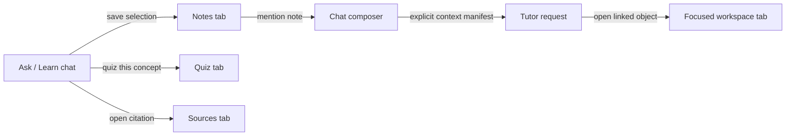
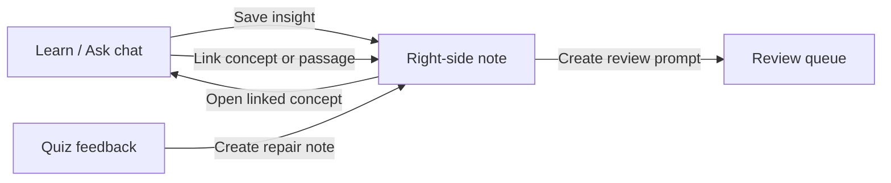
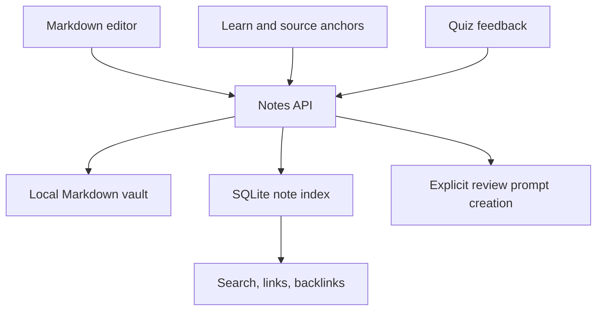

# Note-Taking Feature Plan

## Purpose

Forma needs learner-owned notes because understanding develops through explanation, connection, retrieval, and revision. The notes workspace should help a learner turn a lesson into durable knowledge. It must not overwrite or masquerade as canonical learner evidence.

The initial experience places Learn chat on the left and Notes on the right, each taking roughly half the available desktop width. The learner can resize the divider, collapse either pane, and reopen their preferred layout on the next launch.

## What to learn from Obsidian

Obsidian’s strongest product ideas are not its visual graph alone. They are a local-first ownership model, plain-text durability, lightweight links, context from backlinks, metadata properties, flexible panes, and a deliberately extensible plugin architecture.

| Obsidian pattern | Why it works | Forma adaptation |
| --- | --- | --- |
| Local vault | A learner owns portable files independent of a vendor database. | Store notes as local Markdown plus a small indexed metadata store. Export and backup work without an account. |
| Markdown notes | Plain text is durable, searchable, diffable, and portable. | Use Markdown as the authored body; never lock notes inside a model-specific rich-text format. |
| `[[internal links]]` | Linking is fast enough to become a thinking habit. | Link notes to other notes and to stable Forma objects such as concepts, lessons, attempts, materials, and source passages. |
| Backlinks | Context appears where the learner needs it. | A concept or quiz result shows the learner’s linked notes and mentions. |
| Properties | Metadata remains visible and queryable without living in a separate database UI. | Support a small schema: tags, related concepts, source references, status, review prompt, and creation/update time. |
| Split panes and workspace state | Different tasks need different spatial arrangements. | Persist the chat/notes split ratio, active note, and optional focused pane locally. |
| Search and command palette | A large vault remains usable through quick retrieval. | Provide note search, command shortcuts, and contextual actions before building a visual graph. |
| Plugin boundary | The core stays focused while extensions can evolve. | Define a future skill/extension API after note, link, and permission contracts are stable. |

Primary research references: [Obsidian About](https://obsidian.md/about), [Backlinks](https://help.obsidian.md/Plugins/Backlinks), [Graph view](https://help.obsidian.md/Plugins/Graph+view), [Properties](https://help.obsidian.md/Editing+and+formatting/Properties), and the [Obsidian API](https://docs.obsidian.md/).

## Workspace panel UI and user flow

The right side should be a persistent **workspace panel**, not a fixed Notes feature. Notes are the first primary tab, but learners should be able to create, close, reorder, and return to several task-specific tabs without leaving the Ask/Learn conversation.

### Panel structure

- Learn / Ask chat remains the primary left pane.
- The workspace panel occupies the right half by default and shares a draggable divider with chat.
- A compact tab strip sits at the top of the panel. Tabs show an icon, title, unsaved indicator where relevant, and close control.
- A **New tab** button opens a small launcher with available workspace tools.
- The active tab owns its internal state. Switching away must preserve editor selection, scroll position, filters, current quiz item, and unsaved draft.
- Learners can reorder tabs by dragging and reopen recently closed tabs during the same workspace session.
- The active tab, ordered tab list, widths, collapsed state, and each tab's durable context restore locally after restart.
- On narrow screens, the panel becomes a slide-over or full-screen focused pane. Never reduce chat and notes below readable widths.

### Initial workspace tabs

| Tab | Primary job | How it opens from chat |
| --- | --- | --- |
| Notes | Write, edit, link, and search learner-owned Markdown notes. | “Save to notes,” selected text, or a note mention. |
| Quiz | Complete a standalone or contextual assessment. | “Quiz this concept” or a quiz card. |
| Sources | Inspect selected materials, passages, and citations. | Source chip, citation, or attached material. |

Future tabs should include Review, Concept map, Scratchpad, and Progress only after the panel state model and the first three tabs are dependable.

### Chat and workspace interactions

The two panes share context but remain independently usable. Chat may open or focus a workspace tab; a workspace tab may insert an explicit reference into the composer. Neither pane silently replaces the other.



Examples:

- A learner selects part of a lesson and chooses **Save to notes**. Forma opens an existing Notes tab or creates one with a quoted source anchor.
- A learner clicks **Quiz this concept**. Forma opens a Quiz tab next to their notes while the left conversation remains visible.
- A learner clicks a citation or attached material. Forma opens a Sources tab scoped to that passage.
- A tutor response can offer **Open note**, **Create repair note**, or **View source** actions. These are explicit actions; the model does not open tabs without the learner choosing an action.

### AI-assisted note creation

Ask and Learn can create notes only on the learner's command. The tutor may suggest a note after a lesson, but it must never silently add generated content to the learner's vault.

Supported commands include:

- “Create notes from this lesson.”
- “Turn this explanation into a concise revision note.”
- “Make a note with the key definitions and examples.”
- “Create a mistake note from my quiz feedback.”
- “Summarize the mentioned notes into a study guide.”
- “Add this selected passage to my notes and explain it in my own words.”

The response returns a **note draft card** in chat with title, Markdown body, proposed tags, concept links, source anchors, and a short statement of what was included. The learner can choose **Open in Notes**, **Save as new note**, **Replace selected section**, or **Discard**. Saving opens or focuses a Notes workspace tab and keeps the result editable.

Generated notes must preserve provenance:

- Quote or link source-backed passages when the lesson had supporting material.
- Label tutor-written summaries as AI-generated until the learner edits or explicitly accepts them.
- Identify uncertain or unsupported claims instead of presenting them as course facts.
- Keep the original learner note separate until the learner confirms a replacement.

AI-created notes are learner artifacts, not assessment evidence. They cannot upgrade concept mastery, satisfy a review, or become a verified source without a separate evidence or source-admission action.

### Mentioning notes in Ask / Learn

The composer supports `@` mentions for notes. Typing `@` opens a searchable picker with note title, matched text, linked concepts, and last-edited time. Selecting a note inserts a readable chip such as `@Fourier series basics`; it is backed by the stable note ID rather than its mutable title.

The learner can mention:

- a whole note
- a highlighted note section or heading
- a note link target such as a concept or source passage

Before send, the composer shows a compact context receipt: the exact note titles/sections included, an approximate size, and a remove control. The learner can open the mentioned note in the right panel from the chip.

The request builder resolves mentions into an explicit context manifest containing note ID, revision, selected section, and plaintext excerpt. It supplies only the mentioned content, plus any already-authorized lesson/material context. It must not silently include the learner's full vault, unrelated notes, or note metadata beyond what the learner selected.

Assistant responses should distinguish source-supported facts from learner notes. Learner notes are useful context and may contain errors; they do not become authoritative teaching sources or mastery evidence merely because they were mentioned.

### Contextual tab behavior

- Opening a note from a mention focuses its existing tab if present; otherwise it creates a new Notes tab.
- Chat replies may contain object chips for notes, concepts, attempts, and sources. Clicking one focuses or opens the corresponding workspace tab.
- A Notes tab can insert the current note, a selected heading, or a source-linked quote into the composer through **Mention in chat**.
- A Quiz tab can return a repair recommendation to chat and offer a **Create note from feedback** action.
- Tabs must never discard an unsaved note. Closing prompts to save, discard, or cancel.

## Initial UI and user flow



### Desktop layout

- The existing left navigation remains available.
- Main content becomes a horizontal split view: chat on the left, notes on the right.
- Default split: 50/50, with a minimum readable width for each pane.
- The divider is keyboard accessible and draggable.
- On smaller widths, present Notes as a slide-over panel instead of crushing both views.
- The selected note, split ratio, collapse state, and scroll position restore locally.

### Notes pane states

1. **Empty state:** “Capture what matters” with actions for a blank note, note from current lesson, and note from quiz feedback.
2. **Active note:** Markdown editor, title, linked concepts, tags, and save state.
3. **Context panel:** links/backlinks, relevant materials, lesson anchors, and review prompts.
4. **Search state:** quick note search and filtered notes by concept, material, tag, or due-review connection.

### Core actions

- Create a blank note.
- Capture selected lesson text as a quoted block with a source anchor.
- Turn an assistant explanation into an editable note draft.
- Link a note to a concept through `[[concept:identifier|Readable title]]` syntax or a picker.
- Create a repair note from incorrect quiz feedback.
- Add a self-authored retrieval prompt to a future review item.
- Open a linked concept or source passage from a note.

## Data model and boundaries

### Local note file

Each note is a Markdown file under the user’s Forma data directory:

```text
notes/
  Fourier-series-basics.md
  mistakes/integration-by-parts.md
```

Use YAML front matter for portable properties:

```yaml
---
id: note_01J...
title: Fourier series basics
tags: [signals, revision]
concept_ids: [fourier_series]
created_at: 2026-09-16T12:00:00Z
updated_at: 2026-09-16T12:10:00Z
---
```

The Markdown body may contain standard links and Forma object links. Preserve unknown Markdown and front-matter keys so export/import does not destroy learner content.

### Index and relationships

SQLite indexes note metadata, full-text search terms, links, and source anchors. The index is reconstructable from the note files. Notes remain the source of truth for authored text.

Do not write a note into `LearnerConceptState` automatically. A note can be evidence only when the learner completes an explicit assessment or reflection action with a stated policy. This prevents polished notes from becoming false mastery.

### Link targets

- Other notes
- Concept IDs and graph revisions
- Lesson IDs and block IDs
- Quiz session, item, and attempt IDs
- Material and passage IDs
- Review schedule IDs

Stable IDs let a link survive title edits. When a target no longer exists, render it as a visible broken reference and provide repair/remove actions.

## Architecture



### Backend responsibilities

- Create, read, rename, update, delete, and export notes.
- Safely resolve the notes directory under the app-data root.
- Parse and write front matter without removing unknown fields.
- Rebuild the local index after import, recovery, or file changes.
- Create/query links and backlinks.
- Validate all IDs and material ownership before presenting linked context.
- Version edits or use optimistic concurrency to prevent silent overwrite.

### Frontend responsibilities

- Split-pane layout and persisted workspace state.
- Markdown editor with an edit/preview mode before introducing a complex block editor.
- Fast note picker, link autocomplete, search, backlinks, and a visible save state.
- Contextual “save to notes” actions in Learn and Quiz.
- Accessible keyboard operations and responsive collapse behavior.

## Technology choices

Start with the existing Electron, React, FastAPI, and SQLite stack. Add no sync or plugin framework in the first version.

- Markdown parsing: a conservative front-matter parser and existing Markdown renderer.
- Index/search: SQLite FTS where available; retain a simple fallback query path.
- File watching: desktop-side watcher that requests a reindex after external edits, with debouncing and conflict messaging.
- Rendering: sanitize untrusted Markdown; do not execute arbitrary HTML, scripts, embeds, or plugin code.
- Sync: defer. Local files and export are the compatibility layer until conflict rules and authenticated ownership are ready.

## Phased implementation

### Phase 1 — Useful local notes

Build the split pane, note CRUD API, Markdown files, SQLite index, manual links, note search, and export/delete integration. Add “save selected lesson text” and “create note from quiz feedback.”

### Phase 2 — Learning context

Add backlinks, concept/source/attempt links, note context in Learn and Quiz, repair notes, and review-prompt creation.

### Phase 3 — External editing and graph views

Add file-change detection, conflict handling, link repair, an optional local note graph, and filtered note views. Do not make the graph the primary navigation.

### Phase 4 — Sync and extensions

Only after local reliability: encrypted sync, backups, version history, collaboration policy, and permissioned extensions.

## Quality gates

- A note survives restart, export/import, and index rebuild unchanged.
- Markdown with unknown front matter survives save unchanged.
- Links resolve to the correct stable target after a title rename.
- A deleted target is visible as broken; no silent data loss.
- Notes never change learner mastery without an explicit evidence action.
- The editor remains usable by keyboard and at narrow desktop widths.
- The split layout restores predictably and does not hide the chat composer.

## Decisions to make before implementation

1. Should users be able to open the note vault directly in Obsidian or another editor in Phase 1?
2. Should assistant-generated drafts be visually marked as generated until edited/accepted?
3. Which source-anchor format should be exported when a learner shares a note outside Forma?
4. Should review prompts be stored inside notes, the review queue, or both with a durable link?
